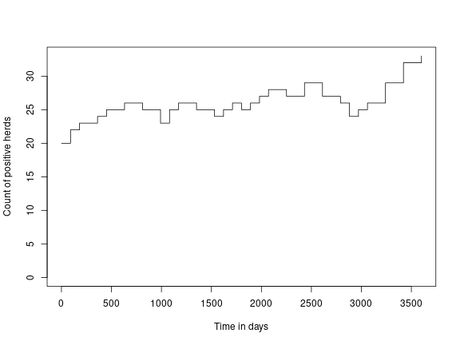
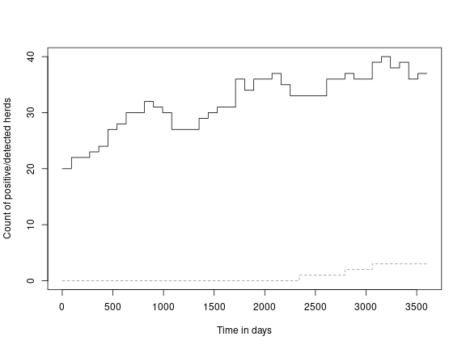
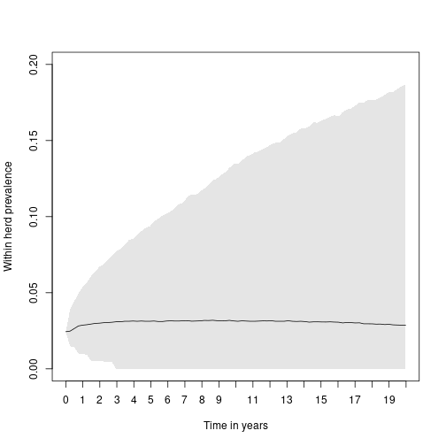

# Model of disease spread and surveillance of paratuberculosis in cattle

[](https://travis-ci.org/trosendal/paratb)

This is an R package of an infectious disease model of
paratuberculosis in cattle. It also includes features that allow for
the simulation of surveillance of paratuberculosis in the study
herds.

## License

The `paratb` package is licensed under the
[GPLv3](https://www.gnu.org/licenses/gpl-3.0.html).

## Installation

Use the `remotes` package to install the package and its dependency from
github like this:


```r
library("remotes")
install_github("trosendal/paratb")
```

## Load the library


```r
library(paratb)
```

To ensure this script is reproducible, we can set the seed and
restrict the number of threads that SimInf uses to 1:


```r
set.seed(42)
set_num_threads(1)
```
## Initialise the model.

In the model used to study spread of paratuberculosis in Sweden we
would use a list of herds in the population and the number of animals
in each herd and age category at the beginning of the study
period. This default model has 10,000 fake farms with 200 animals in each
farm, to change the starting state replace `u0` with another similarly
structured 'data.frame'. Here we initialise the model with the
default fake herds and specify that we want to model over 10 years,
with reported results every 90 days:


```r
model <- paratb(tspan = seq(1, 10*365, 90))
```

## Seed infection in 0.2% of the herds

In the study model, we seeded infection 2% of animals in 0.2% of
herds. We will do the same seeding in this model:


```r
for(i in seq_len(ncol(model@u0)*0.002)) {
model <- seed_herd(model,
                   i,
                   "cow",
                   ceiling(model@u0["S3",i] * 0.02))
model <- seed_herd(model,
                   i,
                   "heifer",
                   ceiling(model@u0["S2",i] * 0.02))
model <- seed_herd(model,
                   i,
                   "calf",
                   ceiling(model@u0["S1",i] * 0.02))
}
```
## Add animal-movement events

In the study model, we used approximately 15 million industry-recorded
animal movements to reflect the real Swedish population over 13
years. Because we cannot share that real movement data, for the sake
of illustration, we will add 1 million random events to send some
animals around between herds.


```r
model <- random_events(model, 1000000)
```
Now we have an initialised model object, ready to run a spread
simulation and look at the results. First run the model:


```r
result <- run(model)
```

Then extract and plot the number of infected herds over time:

```r
df <- counti(result, "true")

plot(df$time,
     df$count,
     type = "s",
     ylim = c(0, max(df$count)),
     ylab = "Count of positive herds",
     xlab = "Time in days")
```




## Add surveillance to the model

In the study model, we added surveillance events to the model to study
various herd selection strategies and numbers of herds tested per year
with a bulk milk ELISA for paratuberculosis. Now run the same model
but inject bulk milk sampling events in 1000 herds per year and
monitor the outcome of that compared to the disease.


```r
years <- max(model@tspan)/365

herds_for_surveillance <- sample(seq_len(ncol(model@u0)),
                                 1000 * years,
                                 replace = TRUE)

times_for_surveillance <- sample(min(model@tspan):max(model@tspan),
                                 length(herds_for_surveillance),
                                 replace = TRUE)

model <- add_surveillance_event(model,
                                i = herds_for_surveillance,
                                t = times_for_surveillance,
                                n = 1L)
```
Run the model again but with the surveillance additional surveillance events:


```r
result <- run(model)
```

Extract the data we need about the herd status and the detection
status and plot it. In the study model we summarised this result over
many trajectories to determine the likely efficacy of the
surveillance. Here we will just look at a single trajectory:


```r
df <- counti(result, "true")
df_bulk_milk <- counti(result, "milk")

plot(df$time,
     df$count,
     type = "s",
     ylim = c(0, max(df$count)),
     ylab = "Count of positive/detected herds",
     xlab = "Time in days")

lines(df_bulk_milk$time,
     df_bulk_milk$count,
     type = "s",
     col = "#939393",
     lty = 2)
```



## A single herd model

The following is an example of the model run in a single holding with
200 animals of which 5 infected adults are added to the "H3"
compartment at day-0 and the model is allowed to run for 20 years. In
this example we run 10000 trajectories of this single herd.


```r
library(paratb)
model <- paratb()
model@u0["H3",] <- 5L
model@tspan <- seq(1, 365*20, by = 90)
model_result <- run(model)
```

We can then extract and the outcome from each of the trajectories of
the model and summarize the within herd prevalence over time:


```r
traj <- paratb::prev(model_result, "true", "wnp")
med <- tapply(traj$prevalence, traj$time, median)
low95 <- tapply(traj$prevalence, traj$time, function(x) {
    quantile(x, 0.025)
})
high95 <- tapply(traj$prevalence, traj$time, function(x) {
    quantile(x, 0.975)
})
regiony <- c(low95, rev(high95), low95[1])
regionx <- names(regiony)
x <- seq(0, 20*365, 365)
xyears <- 0:20
```

And finally plot the median result of the within herd prevalence and a
credibility interval illustrating the central 95% of trajectories in
the experiment over time:


```r
plot(x = names(med),
     y = med,
     pch = 20,
     type = "l",
     ylim = c(0, 0.2),
     xaxt = "n",
     xlab = "Time in years",
     ylab = "Within herd prevalence",
     main = "", cex.axis = 1, cex.lab = 1, cex.main = 1.5, font.main = 1)
polygon(regionx, regiony, col = "#0000001A", border = NA)
axis(side = 1,
     at = x,
     labels = xyears,
     cex.axis = 1, cex.lab = 1, cex.main = 1)
```



## Session Information

This vignette was generated with paratb package version
1.1, SimInf version
8.0.0.9000 and R version 4.0.3 (2020-10-10).
